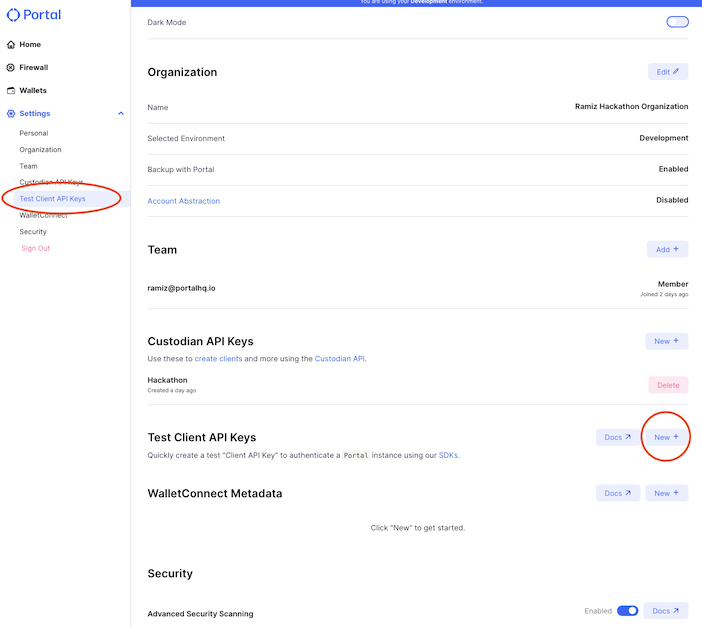
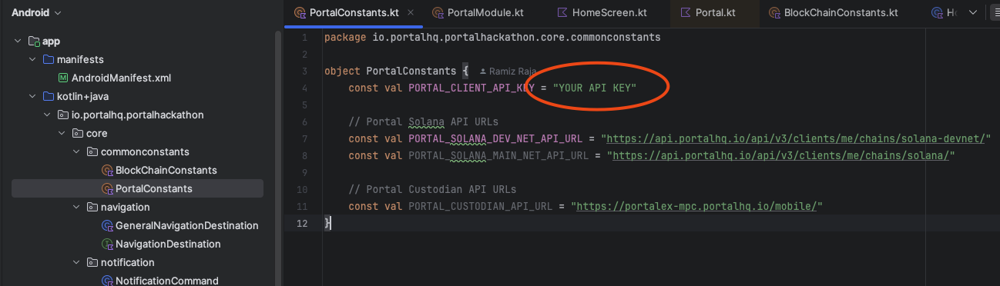
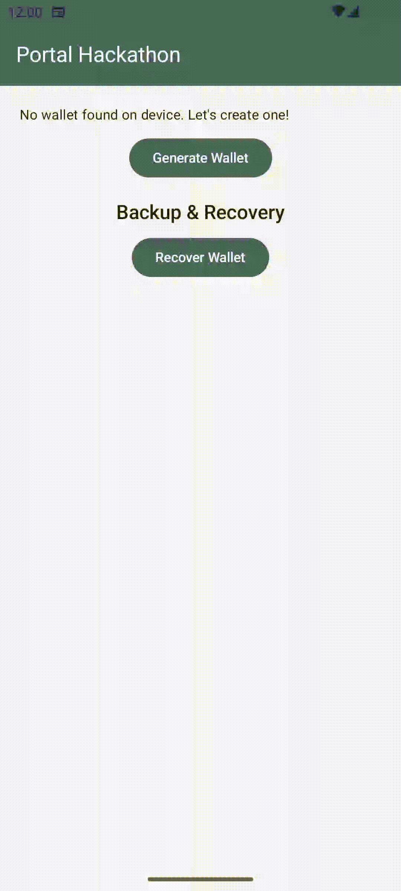

# Portal Hackathon Helper Repository

This repository shows you how you can easily integrate Solana blockchain into your Android app using the [Portal Android SDK](https://docs.portalhq.io/guides/android). It covers the following features.

1. Generate a Solana Wallet
2. Fetch and display Solana and PyUSD balances.
3. Transfer PyUSD to a given Solana address.
4. Backup the wallet with password as the key to Portal servers.
5. Recover the wallet with password as the key from Portal servers.

Portal SDK also covers the following backup method which were not covered in this example app but you learn how to implement them through our [docs](https://docs.portalhq.io/guides/android/back-up-a-wallet).

1. Backup with iCloud
2. Backup with GDrive
3. Backup with Passkey

## How to Run This Example App
1. Clone the repo to your local system
2. Open the project in your Android Studio.
3. Go to your Portal Dashboard [settings page](https://app.portalhq.io/settings#client-api-keys) and create a client test API key (screenshots are attached below for your convenience).
4. Update the **PORTAL_CLIENT_API_KEY** field in `app/src/main/java/io/portalhq/portalhackathon/core/commonconstants/PortalConstants.kt` with your Portal client id (screenshot below).
5. Run the app and it should work without any issues.

## Understanding the Example App
Most of the files in the app are for skeleton of the app and not directly related to Portal SDK. Below are the important files which have Portal SDK code in Action.

1. `PortalModule.kt`: This is where **Portal SDK** is being initialized. For more info on how to initialized Portal SDK please refer to [this doc](https://docs.portalhq.io/guides/android).
2. `PortalRepository.kt`: This repository file contains all the features that are performed in this example app using the Portal Android SDK like createWallet, backupWallet, sendPyUsd etc.
3. `PortalSolanaApi.kt`: This file contains code to interact with **Portal Assets API** which is used to build a solana transaction and also fetch solana balances. In the future we do plan to integrate it inside our SDK but for now it is separate and hence the separate API client here.
4. `BlockChainConstants.kt`: This file contains common blockchain related constants (like solana keychain urls).
5. `PortalConstants.kt`: This file contains common Portal related constants (like Portal client API key).
6. `HomeScreen.kt`: This is the main screen UI of the app which contains all UI elements of this app (like generate wallet, transfer PyUSD etc.)
7. `HomeViewModel.kt`: This ViewModel controls the presentation and events coming from **HomeScreen.kt** and also holds the view state for this screen.

You can ignore all other files as those files are all helper classes.

## Faucets for App Testing
To fully test this app (like for example to transfer funds) you will need to load your wallet with TestNet Solana and PyUSD tokens. Below are some faucets that you can use.

- [SOL Faucet](https://faucet.solana.com/)
- [PYUSD Faucet](https://faucet.paxos.com/)

## Demos

#### Generate Wallet Demo
 

#### Transfer PyUSD Demo

#### Recover Wallet from Portal Servers with Password as the Key

#### Backup and Recover Demo

## Portal & PYUSD Documentation

### Portal SDK Reference

Portal's SDKs have several pieces of core functionality.

- [Generating a Wallet](https://docs.portalhq.io/guides/web/create-a-wallet): This function creates MPC key shares on your local device and the Portal servers. These key shares support all EVM chains and Solana.
- [Signing a Transaction](https://docs.portalhq.io/guides/web/sign-a-transaction): This function signs a provided transaction, and can broadcast that transaction to a chain when an RPC gateway URL is provided.
- [Signature Hooks](https://docs.portalhq.io/guides/web/add-custom-signature-hooks): By default this repo will submit a transaction without prompting a user, but you can use signature hooks to build a prompt for users before submitting a transaction for signing.

### Portal APIs

Portal supplies several APIs for simplifying your development.

- [Get Assets](https://docs.portalhq.io/reference/client-api/v3-endpoints#get-assets-by-chain): This endpoint returns a list of fungible asset (native, ERC-20, and SPL tokens) associated with your client for a given chain.
- [Get NFTs](https://docs.portalhq.io/reference/client-api/v3-endpoints#get-nft-assets-by-chain): This endpoint returns a list of the NFTs associated with your client for a given chain.
- [Get Transactions](https://docs.portalhq.io/reference/client-api/v3-endpoints#get-transactions-by-chain): This endpoint returns a list of the historic transactions associated with your client for a given chain.
- [Build a Transaction - Send Asset](https://docs.portalhq.io/reference/client-api/v3-endpoints#build-a-send-asset-transaction): This endpoint builds a formatted transaction to send a fungible asset (native, ERC-20, and SPL tokens) for a given chain.
- [Evaluate a Transaction](https://docs.portalhq.io/reference/client-api/v3-endpoints#evaluate-a-transaction): This endpoint can simulate a transaction and/or scan a transaction for security concerns.

### PYUSD Documentation

- [PYUSD on Solana](https://solana.com/news/pyusd-paypal-solana-developer): An overview of PYUSD on Solana.
- [PYUSD Quick Start Guide](https://developer.paypal.com/community/blog/pyusd-quick-start-guide/): A quick overview of PYUSD and information behind it.
- [PYUSD Solana Testnet Faucet](https://faucet.paxos.com/): Use this faucet to get testnet PYUSD on Solana.
- [What is PayPal USD](https://www.paypal.com/us/cshelp/article/what-is-paypal-usd-pyusd-help1005): Information about how PYUSD works.
- [PYUSD Solana (SPL) Mainnet Address](https://explorer.solana.com/address/2b1kV6DkPAnxd5ixfnxCpjxmKwqjjaYmCZfHsFu24GXo): `2b1kV6DkPAnxd5ixfnxCpjxmKwqjjaYmCZfHsFu24GXo`
- [PYUSD Solana (SPL) Devnet Address](https://explorer.solana.com/address/CXk2AMBfi3TwaEL2468s6zP8xq9NxTXjp9gjMgzeUynM?cluster=devnet): `CXk2AMBfi3TwaEL2468s6zP8xq9NxTXjp9gjMgzeUynM`

### Solana Documentation

- [Intro to Solana Development](https://solana.com/developers/guides/getstarted/hello-world-in-your-browser): An introduction to development on Solana.
- [Solana SPL Token Docs](https://spl.solana.com/token): Documentation on SPL tokens.

### Faucets

- [SOL Faucet](https://faucet.solana.com/)
- [PYUSD Faucet](https://faucet.paxos.com/)

### Other Helpful Resources

- [What is Portal MPC?](https://docs.portalhq.io/resources/portals-mpc-architecture)

## Help

Need help or want to request a feature? Reach out to the PayPal & Portal teams on the [official hackathon Slack channel](https://portalcommunity.slack.com/archives/C07EZFF9N78).